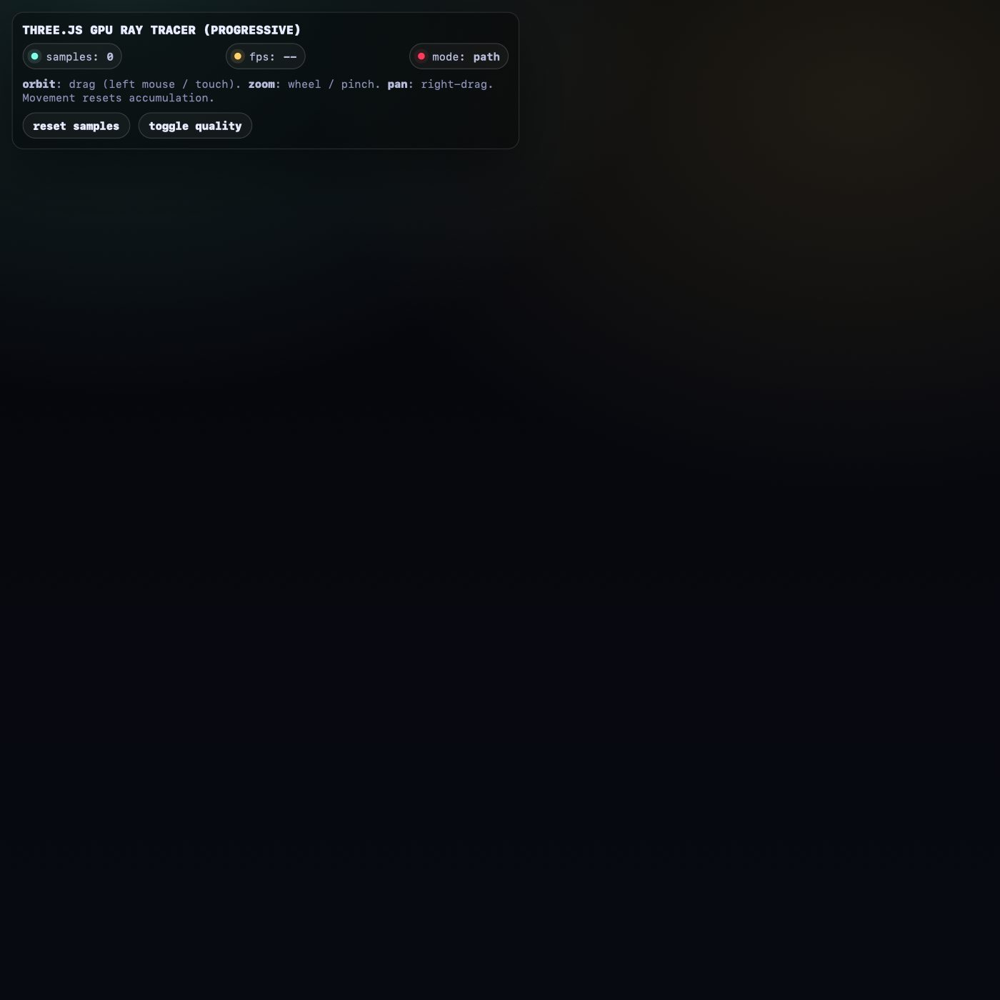

# Three Raytracer

Single-file browser ray tracer / path tracer experiment built with Three.js and custom GLSL shaders.

## What It Is

This project is a self-contained HTML demo (`three_raytracer.html`) that renders a progressive GPU ray-traced scene in the browser using:

- `three.js` for WebGL setup and fullscreen rendering passes
- custom fragment shaders for path tracing + accumulation
- ping-pong render targets for progressive sampling
- simple orbit/pan/zoom camera controls implemented inline (no external controls dependency)
- a small HUD showing samples, FPS, and mode

## Features

- Progressive sample accumulation (resets on camera movement)
- Diffuse bounces with cosine-weighted hemisphere sampling
- Basic direct lighting + emissive lamp + sky lighting
- Tonemapping / gamma pass
- Toggleable quality mode (changes internal render resolution)
- Single-file distribution (easy to open/share)

## Running It

Because the page imports Three.js as an ES module from a CDN, some browsers may block it under `file://`.

Recommended:

```bash
python3 -m http.server
```

Then open:

- `http://localhost:8000/three_raytracer.html`

## Controls

- Orbit: left-drag (or touch drag)
- Pan: right-drag
- Zoom: mouse wheel / pinch
- `reset samples`: clears accumulation
- `toggle quality`: switches internal render resolution

## Screenshot

Below is a sample preview capture of the HTML page UI. This screenshot is illustrative and may not show a fully converged render (it is not a benchmark or final-quality output image).



## Notes

- The HTML is intentionally standalone for portability.
- Three.js is loaded from `unpkg` in the page at runtime.
- If you want, this can be split into modules (`js/`, shader strings, controls, renderer loop) later.
